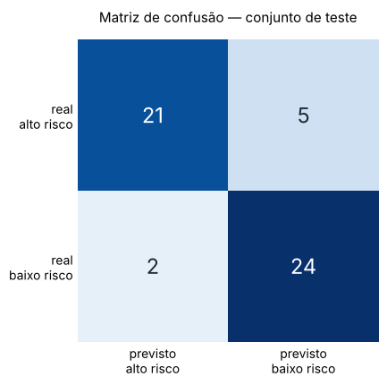
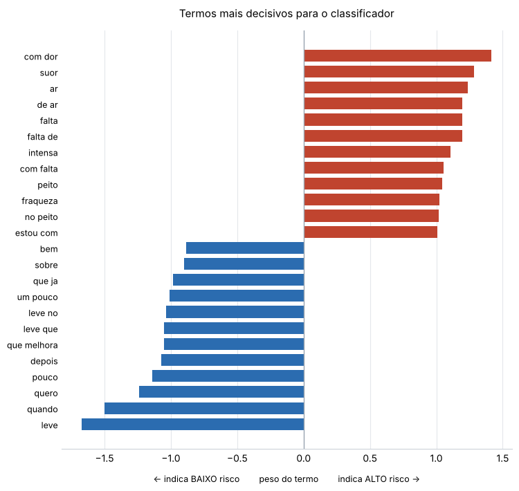

# FIAP - Faculdade de Informática e Administração Paulista

<p align="center">
<a href= "https://www.fiap.com.br/"></a>
</p>

<br>

# CardioIA — Fase 2: Diagnóstico Automatizado (IA no Estetoscópio Digital)

## Grupo 89

🎥 **Vídeo de demonstração (4 min):** `[COLE AQUI O LINK DO YOUTUBE — não listado]`

## 👨‍🎓 Integrantes:
- <a href="https://www.linkedin.com/company/inova-fusca">Gabriel Coppola</a>

## 👩‍🏫 Professores:
### Tutor(a)
- <a href="https://github.com/Leoruiz197">Leonardo Ruiz</a>


## 📜 Descrição

O **CardioIA** é uma plataforma acadêmica que simula o ecossistema de uma cardiologia
moderna. Esta **Fase 2 — Diagnóstico Automatizado** transforma o relato de um paciente,
escrito em texto livre, em duas respostas: **o que ele pode ter** e **se é grave**.

O projeto foi construído em duas abordagens deliberadamente diferentes, para que o
contraste entre elas seja ele próprio o aprendizado.

**Parte 1 — Extração de sintomas (abordagem simbólica).** Dez relatos escritos como um
paciente escreveria alimentam um extrator que identifica sintomas e propõe diagnósticos.
A base de conhecimento tem três camadas: 10 frases de entrada, um mapa com 63 regras no
formato `sintoma_1 · sintoma_2 · doença · peso · urgência`, e uma tabela de 162 expressões
coloquiais mapeadas para sintomas canônicos. Essa terceira camada é o que faz o sistema
funcionar com texto real — ninguém escreve "apresento palpitação", escrevem "sinto o
coração disparar". Uma regra só "fecha" quando os dois sintomas aparecem (peso × 2,0);
casamento parcial vale pouco (peso × 0,5), para que "dor no peito" sozinha não puxe um
infarto. O desempate é pelo número de regras fechadas, e a urgência adotada é sempre a
mais alta entre as regras acionadas — em triagem, erra-se para o lado seguro. Resultado:
100% de cobertura nos 10 relatos. O sistema distingue angina estável de infarto no mesmo
relato (o que desempata é a melhora com repouso) e exibe os diagnósticos diferenciais com
a evidência que sustentou cada um.

**Parte 2 — Classificador de risco (abordagem estatística).** Uma base de 205 frases
rotuladas como alto ou baixo risco é vetorizada com TF-IDF (unigramas e bigramas) e
usada para treinar três modelos. O Naive Bayes venceu, com 86,5% de acurácia e 80,8% de
recall em alto risco. A escolha do modelo foi feita por **recall**, não por acurácia,
porque os dois erros não custam a mesma coisa: um alarme falso gasta tempo de equipe;
um caso grave liberado vai para a fila comum.

O achado central da fase está na análise crítica: o modelo acerta, em parte, **pelo
motivo errado**. Ele aprendeu vocabulário e intensificadores, não fisiopatologia. Isso
está documentado com evidência no notebook e resumido na seção de resultados abaixo.

A Parte 1 sempre sabe explicar por que decidiu; a Parte 2 acerta mais, mas precisa ser
auditada para que se descubra por quê. É essa tensão — explicabilidade contra desempenho —
que define boa parte das decisões de IA aplicada à saúde.


## 📁 Estrutura de pastas

Dentre os arquivos e pastas presentes na raiz do projeto, definem-se:

- <b>.github</b>: Nesta pasta ficarão os arquivos de configuração específicos do GitHub que ajudam a gerenciar e automatizar processos no repositório.

- <b>assets</b>: aqui estão os arquivos relacionados a elementos não-estruturados deste repositório, como imagens. Contém o logo da FIAP e os gráficos gerados pelo notebook (`matriz_confusao.png`, `termos_decisivos.png`).

- <b>config</b>: Posicione aqui arquivos de configuração que são usados para definir parâmetros e ajustes do projeto. Contém o `requirements.txt` com as versões das bibliotecas.

- <b>document</b>: aqui estão todos os documentos do projeto que as atividades poderão pedir. Contém o `ROTEIRO_VIDEO.md` (roteiro cronometrado da demonstração) e o `classificador_risco.html` (notebook renderizado, abre sem Jupyter). Na subpasta "other", os documentos complementares: saída completa da Parte 1 e o resultado em formato tabular.

- <b>scripts</b>: Posicione aqui scripts auxiliares para tarefas específicas do seu projeto. Contém o `executar_tudo.sh`, que roda as duas partes de ponta a ponta.

- <b>src</b>: Todo o código fonte criado para o desenvolvimento do projeto ao longo das 7 fases. Organizado em `dados/` (as quatro bases), `parte1_extracao/` (extrator de sintomas) e `parte2_classificador/` (notebook do classificador).

- <b>README.md</b>: arquivo que serve como guia e explicação geral sobre o projeto (o mesmo que você está lendo agora).

```
cardioia-fase2/
├── .github/
├── assets/
│   ├── logo-fiap.png
│   ├── matriz_confusao.png
│   └── termos_decisivos.png
├── config/
│   └── requirements.txt
├── document/
│   ├── ROTEIRO_VIDEO.md
│   ├── classificador_risco.html
│   └── other/
│       ├── diagnosticos.csv
│       └── relatorio_parte1.txt
├── scripts/
│   └── executar_tudo.sh
├── src/
│   ├── dados/
│   │   ├── frases_pacientes.txt        Parte 1 — 10 relatos de pacientes
│   │   ├── mapa_conhecimento.csv       Parte 1 — ontologia (63 regras)
│   │   ├── sinonimos.csv               Parte 1 — 162 expressões → sintoma canônico
│   │   └── frases_risco.csv            Parte 2 — 205 frases rotuladas
│   ├── parte1_extracao/
│   │   └── extrator_sintomas.py
│   └── parte2_classificador/
│       └── classificador_risco.ipynb
├── .gitattributes
├── .gitignore
└── README.md
```


## 🔧 Como executar o código

**Pré-requisitos**

| Item | Versão testada |
|------|----------------|
| Python | 3.11+ |
| pandas | 3.0 |
| scikit-learn | 1.9 |
| matplotlib | 3.11 |
| Jupyter Notebook | qualquer versão recente |

**Instalação**

```bash
git clone https://github.com/SEU_USUARIO/cardioia-fase2.git
cd cardioia-fase2
pip install -r config/requirements.txt
```

**Fase 2 — Parte 1: extração de sintomas**

```bash
python src/parte1_extracao/extrator_sintomas.py

# salvando o resultado em CSV
python src/parte1_extracao/extrator_sintomas.py --csv document/other/diagnosticos.csv

# analisando uma frase avulsa
python src/parte1_extracao/extrator_sintomas.py --frase "sinto dor no peito ao subir escadas"
```

O script localiza a pasta `src/dados` sozinho, subindo a árvore de diretórios — pode ser
executado da raiz do repositório ou de dentro de qualquer subpasta.

**Fase 2 — Parte 2: classificador de risco**

```bash
jupyter notebook src/parte2_classificador/classificador_risco.ipynb
```

Execute as células na ordem (**Kernel → Restart & Run All**). Sem Jupyter instalado, abra
`document/classificador_risco.html` no navegador: o notebook está salvo com todas as
saídas e gráficos.

**Tudo de uma vez**

```bash
bash scripts/executar_tudo.sh
```


## 📊 Resultados e análise crítica

### Parte 1 — exemplo de saída

```
PACIENTE 01
Relato: "Há dois dias sinto uma dor forte no peito que aperta quando subo escadas
         e melhora se eu paro para descansar."

Sintomas extraídos:
  - melhora com repouso   (do trecho: "paro para descansar")
  - dor no peito          (do trecho: "dor forte no peito")
  - subir escadas         (do trecho: "subo escadas")
  - aperto no torax       (do trecho: "aperta")

Hipótese principal: Angina Estavel        Pontuação: 17.5   Confiança: alta
  Conduta ... URGENTE - avaliação médica em até 24h
  Evidência . aperto no torax + melhora com repouso;
              dor no peito + subir escadas; dor no peito + melhora com repouso

  Diagnósticos diferenciais:
    - Infarto Agudo do Miocardio      8.0 pts
    - Angina Instavel                 3.0 pts
```

Cobertura de **100%**. Triagem resultante: 2 emergências, 5 urgentes, 3 de rotina.

### Parte 2 — desempenho

| Modelo | Acurácia | Recall alto risco |
|--------|----------|-------------------|
| **Naive Bayes** (escolhido) | **86,5%** | **80,8%** |
| Regressão Logística | 84,6% | 76,9% |
| Árvore de Decisão | 73,1% | 61,5% |

Validação cruzada (5 divisões): **80,0% (±6,4%)** — a faixa honesta de desempenho.

<p align="center">

</p>

Cinco casos graves passaram como baixo risco. Em triagem real isso é inaceitável sem
revisão humana — daí a zona cinzenta implementada na função `triar()` do notebook.

### O achado: o modelo acerta pelo motivo errado

<p align="center">

</p>

Os termos que mais empurram para **baixo risco** não são clínicos: são
*"leve"*, *"pouco"*, *"quando"*, *"quero"*. O modelo aprendeu a **intensidade do
advérbio**, não a gravidade do quadro. Do outro lado, "peito" aparece em 40,6% das frases
graves contra 11,5% das leves — um atalho lexical clássico.

Os erros no conjunto de teste confirmam, nas duas direções:

| Erro | Frase | O que revela |
|------|-------|--------------|
| falso **positivo** | *"mancha vermelha no braço sem dor nem febre"* | "braço" é termo forte da classe grave (vem de "irradia para o braço esquerdo") — e aqui não significa nada |
| falso **positivo** | *"pressão 12 por 8 na consulta de rotina"* | escalada pela palavra "pressão", ignorando que o valor é normal |
| falso **negativo** | *"ganhei quatro quilos em cinco dias e estou inchado"* | retenção hídrica — sinal clássico de IC descompensada, sem o vocabulário dominante |
| falso **negativo** | *"tive dois desmaios essa semana sem motivo aparente"* | síncope de repetição, urgente por definição |
| falso **negativo** | *"meu pulso está muito lento e estou com sono o dia todo"* | bradicardia sintomática |

### Um segundo achado, metodológico

Escrevemos seis frases adversariais **de propósito** para derrubar o modelo — e ele
**passou nas seis**. Foram os erros reais do conjunto de teste que expuseram o problema,
sem esforço nenhum.

A lição ficou registrada no notebook em vez de ser apagada: quem escreve o teste do
próprio modelo tende a testar o viés que **imagina** ter, não o que o modelo **tem**.
Olhar os erros é mais honesto do que prever onde eles estariam.

### O limiar de decisão é uma decisão clínica, não estatística

| Limiar | Acurácia | Recall alto risco | Casos graves perdidos | Alarmes falsos |
|--------|----------|-------------------|----------------------|----------------|
| 0,50 | 86,5% | 80,8% | **5** | 2 |
| 0,40 | 76,9% | 88,5% | 3 | 9 |
| 0,35 | 75,0% | 96,2% | **1** | 12 |
| 0,25 | 57,7% | 100,0% | **0** | 22 |

Cada linha é uma política de triagem diferente. Escolher uma é decidir quantos alarmes
falsos o serviço aguenta para não perder um infarto — conversa com o corpo clínico, não
com o time de dados sozinho.

### Ligação com a Fase 1 e próximos passos

Na Fase 1 o achado foi que a coluna `target` do dataset estava **invertida** em relação à
convenção do UCI. Aqui, que o modelo acerta em parte pelo vocabulário. Mesmo tipo de
problema: **o número bonito na tela não prova que o sistema entendeu a questão.**

| Limitação atual | Para onde vai |
|-----------------|---------------|
| Atalho lexical | ampliar a base com dor torácica benigna e quadros graves sem dor |
| TF-IDF não entende contexto | *embeddings* em português (BERTimbau) |
| Sem explicabilidade | SHAP/LIME mostrando ao profissional qual trecho pesou |
| 1 em 5 casos graves perdidos | limiar calibrado com o corpo clínico + revisão humana |
| Métrica agregada esconde desigualdade | reportar desempenho **estratificado** por perfil |


## 🗃 Histórico de lançamentos

* 0.2.0 - 06/10/2026
    * Reorganização do repositório no template oficial FIAP
    * Gráficos exportados para `assets` e notebook renderizado em `document`
* 0.1.0 - 06/10/2026
    * Fase 2 completa: extrator de sintomas (Parte 1) e classificador de risco (Parte 2)
    * Mapa de conhecimento com 63 regras e 162 expressões mapeadas
    * Base de 205 frases rotuladas, TF-IDF e comparação de três modelos
    * Análise de viés, teste adversarial e calibração de limiar


## 📋 Licença

<p xmlns:cc="http://creativecommons.org/ns#" xmlns:dct="http://purl.org/dc/terms/"><a property="dct:title" rel="cc:attributionURL" href="https://github.com/agodoi/template">MODELO GIT FIAP</a> por <a rel="cc:attributionURL dct:creator" property="cc:attributionName" href="https://fiap.com.br">Fiap</a> está licenciado sobre <a href="http://creativecommons.org/licenses/by/4.0/?ref=chooser-v1" target="_blank" rel="license noopener noreferrer" style="display:inline-block;">Attribution 4.0 International</a>.</p>
